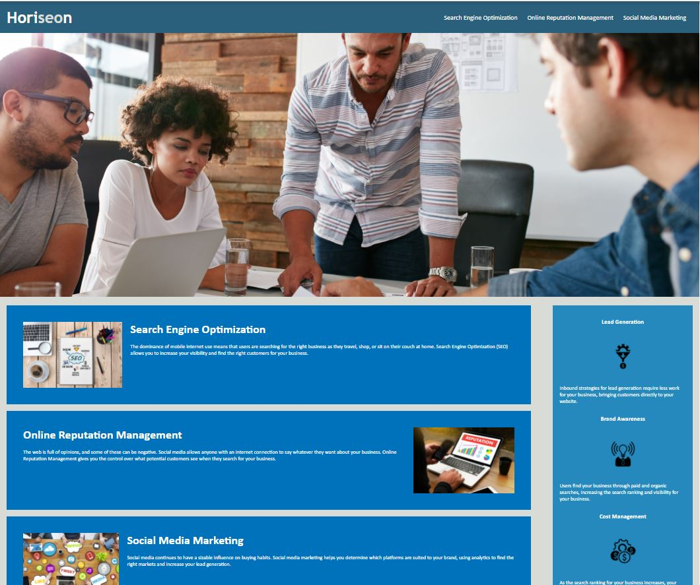

# Horiseon Website

## Purpose
Module 1, Challenge 1 for University of Minnesota Coding Booking, Fall 2021

Code Refactoring Exercise based on existing code base provided by the program.

### User Story:

AS A marketing agency
I WANT a codebase that follows accessibility standards
SO THAT our own site is optimized for search engines

### Acceptence Criteria
GIVEN a webpage meets accessibility standards
WHEN I view the source code
THEN I find semantic HTML elements
WHEN I view the structure of the HTML elements
THEN I find that the elements follow a logical structure independent of styling and positioning
WHEN I view the image elements
THEN I find accessible alt attributes
WHEN I view the heading attributes
THEN they fall in sequential order
WHEN I view the title element
THEN I find a concise, descriptive title

## Example Site Rendering

## Built With
* HTML
* CSS

## Website
Link Needed

## Contribution
Made with ❤️ by GitAndrewCoffee
